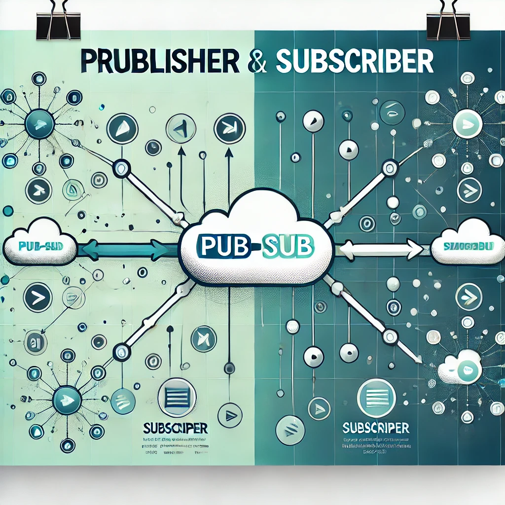

Here's the updated `README.md` code with the image included at the top:

```markdown
# Pub-Sub Application



This repository demonstrates a Pub-Sub (Publisher-Subscriber) architecture using Go, organized into modules for better maintainability.

## Project Structure

```

pub-sub/
│
├── credentials/
│   └── erebrus-dev-8a8013424626.json   # Service account key (Google Pub/Sub or other credentials)
│
├── pubsub/internal/
│   ├── config/
│   │   └── config.go                   # Configurations for the application
│   ├── publisher/
│   │   └── publisher.go                # Core logic for publishing messages
│   └── subscriber/
│       └── subscriber.go               # Core logic for subscribing to messages
│
├── src/
│   ├── publisher/
│   │   └── main.go                     # Entry point for the Publisher
│   └── subscriber/
│       └── main.go                     # Entry point for the Subscriber
│
├── .gitignore                          # Ignoring sensitive files and build artifacts
├── go.mod                              # Go module dependencies
├── go.sum                              # Dependency checksum
└── README.md                           # Project documentation

```

## Prerequisites

- Go 1.20 or later installed
- [Google Cloud SDK](https://cloud.google.com/sdk/docs/install) (if using Google Cloud Pub/Sub)
- A valid service account JSON key (`credentials/erebrus-dev-8a8013424626.json`)

## Installation

Clone the repository:

```bash
git clone https://github.com/your-repo/pub-sub.git
cd pub-sub
```

Install dependencies:

```bash
go mod tidy
```

## Configuration

Set up your configuration in `pubsub/internal/config/config.go`. Add any necessary credentials or environment-specific values.

## Running the Application

### Publisher

Navigate to the `src/publisher` directory and run:

```bash
go run main.go
```

### Subscriber

Navigate to the `src/subscriber` directory and run:

```bash
go run main.go
```

## Example Usage

The publisher will send messages to the topic, and the subscriber will listen for messages in real-time.

---

Add the image to your project directory and reference it in the `README.md` file as shown above.
Let me know if you need help with anything else!
